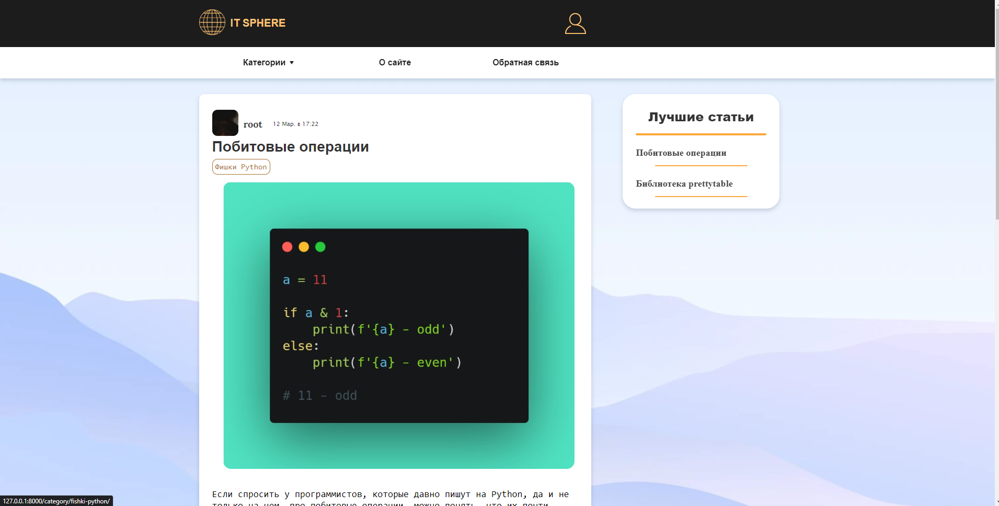
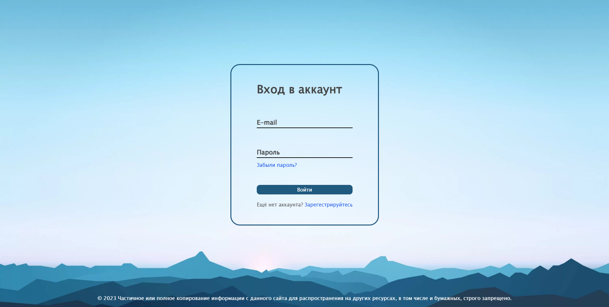
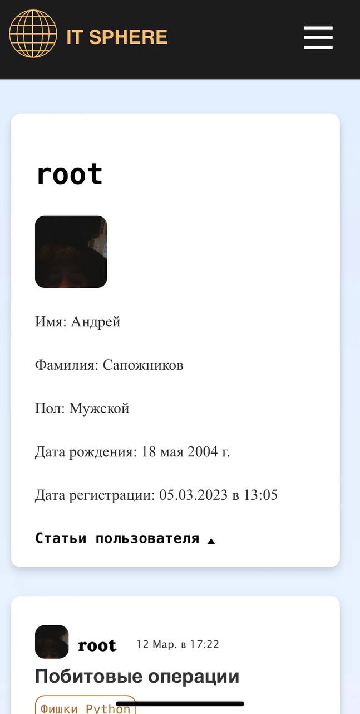

# My first website written in Django

<p align="center">
<a href="https://github.com/simple-icons/simple-icons/actions?query=workflow%3AVerify+branch%3Adevelop"></a>
<a href="https://github.com/simple-icons/simple-icons/actions?query=workflow%3AVerify+branch%3Adevelop"></a>
</p>

-----
## About Project
<h5>This is my first full-scale django project. The goal of the project is to get acquainted with all aspects of the Python language from the point of view of Web development, as well as with the powerful Django framework. Don't judge strictly 😄</h2>
-----
## Site Visual



<p align="center">

</p>

-----
## Configuration 
<h5>Container can be configured via environment variables</h5>

`SECRET_KEY` - secret key your app

`EMAIL_HOST` - the host to use for sending email `default = smtp.gmail.com`

`EMAIL_FROM` - email address to use for various automated correspondence from the site manager(s)

`EMAIL_HOST_USER` - username to use for the SMTP server defined in EMAIL_HOST

`EMAIL_HOST_PASSWORD` - password to use for the SMTP server defined in EMAIL_HOST

-----

## Installation

```
git clone https://github.com/tdlib/telegram-bot-api.git

docker build -f ./Dockerfile -t my_site_django:latest .

docker run -d -p 8000:8000 -e "SECRET_KEY=<secret_key>" my_site_django python /us
r/src/app/manage.py runserver 0.0.0.0:8000
```

### ⚠️Warning

<h5>To use all the functionality of the application, fill in all the environment variables</h5>

-----

## Bugs
<h5>There is a problem in the project at the moment - adaptive layout may not work correctly on some devices. This will be fixed soon..</h5>
